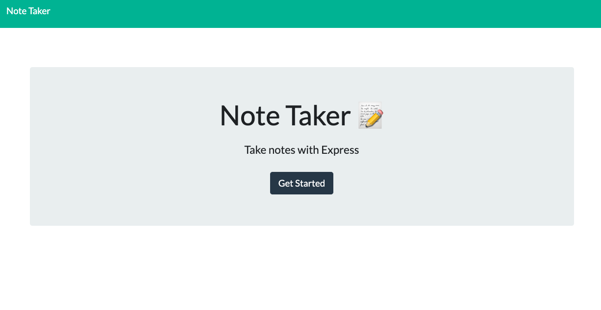
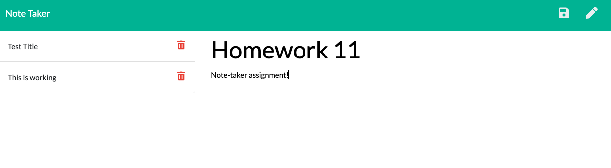

# Note-Taker-Application

## Description

AS A user, I want to be able to write and save notes

I WANT to be able to delete notes I've written before

SO THAT I can organize my thoughts and keep track of tasks I need to complete

## **Table of Contents**

* [Installation](#installation)
* [Usage](#usage)
* [Contributing](#usage)
* [Test](#test)
* [Questions](#questions)
* [License](#license)

## Installation

Fork repository at [gstephbolivar github](https://github.com/gstephbolivar/note-taker) .

-npm init 

-npm install express

-npm install path

-npm inquirer --save

-npm install uuid

-heroku create

Happy Editing!

## Usage

This [heroku deployed application](https://floating-plains-97674.herokuapp.com/) allows a user to write, save and delete notes. If a user needs to create a note this application will allow them to title their note and then write in the text area. Once the note is saved, it renders to a list by title on the left hand side of the screen, allowing for easy access to notes. 

## Contributing

A user can contribute by styling the webpage differently. 

## Test

## Credits

I credit the following people and websites for assistance on this application:

[NPMJS UUID Documentation](https://www.npmjs.com/package/uuid)

## Questions

####  **Stephany Bolivar** 
*  **Github:** [@gstephbolivar](https://github.com/gstephbolivar)
*  **Email:** [g.stephanybolivar@gmail.com](g.stephanybolivar@gmail.com)

## License

MIT License

Copyright (c) [2020] [Gloria Stephany Bolivar]

Permission is hereby granted, free of charge, to any person obtaining a copy
of this software and associated documentation files (the "Software"), to deal
in the Software without restriction, including without limitation the rights
to use, copy, modify, merge, publish, distribute, sublicense, and/or sell
copies of the Software, and to permit persons to whom the Software is
furnished to do so, subject to the following conditions:

The above copyright notice and this permission notice shall be included in all
copies or substantial portions of the Software.

THE SOFTWARE IS PROVIDED "AS IS", WITHOUT WARRANTY OF ANY KIND, EXPRESS OR
IMPLIED, INCLUDING BUT NOT LIMITED TO THE WARRANTIES OF MERCHANTABILITY,
FITNESS FOR A PARTICULAR PURPOSE AND NONINFRINGEMENT. IN NO EVENT SHALL THE
AUTHORS OR COPYRIGHT HOLDERS BE LIABLE FOR ANY CLAIM, DAMAGES OR OTHER
LIABILITY, WHETHER IN AN ACTION OF CONTRACT, TORT OR OTHERWISE, ARISING FROM,
OUT OF OR IN CONNECTION WITH THE SOFTWARE OR THE USE OR OTHER DEALINGS IN THE
SOFTWARE.
